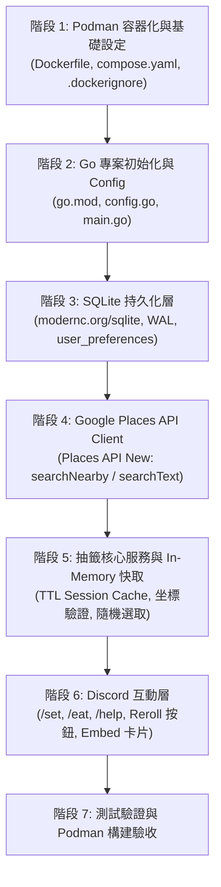

# Implementation Plan - Discord 餐廳抽籤機器人 (Go + Podman)

本實作計畫旨在遵循 [SPEC.md](file:///home/shaun/Code/random_eat_discord/SPEC.md) 的規範，使用 Go 語言開發高效、低資源佔用且整合 Google Places API (New) 的 Discord 餐廳抽籤機器人，並使用 Podman 進行容器化開發與部署。

---

## 專案結構規劃

```
random_eat_discord/
├── .dockerignore
├── .env.example
├── Dockerfile
├── compose.yaml
├── SPEC.md
├── go.mod
├── go.sum
├── cmd/
│   └── bot/
│       └── main.go                 # 程式進入點、信號攔截、依賴注入
├── internal/
│   ├── config/
│   │   └── config.go              # 環境變數讀取與驗證
│   ├── db/
│   │   ├── db.go                  # SQLite 初始化 (WAL、PRAGMA、單連線池)
│   │   └── repository.go          # user_preferences CRUD 實作
│   ├── googlemaps/
│   │   ├── client.go              # Places API (New) HTTP Client 封裝
│   │   ├── models.go              # Places API 請求/回應資料結構
│   │   └── places.go              # searchNearby 與 searchText 呼叫實作
│   ├── lottery/
│   │   ├── service.go             # 抽籤核心邏輯、坐標驗證、名單隨機選取
│   │   └── session_cache.go       # In-Memory 候選清單快取 (支援 TTL 與重抽排重)
│   └── discord/
│       ├── bot.go                 # Discordgo 初始化、Slash Command 註冊與清理
│       ├── handlers.go            # Interaction 路由 (Deferred 處理、逾時防護)
│       ├── commands.go            # /set, /eat, /help 處理器
│       ├── components.go          # reroll 按鈕互動事件處理
│       └── views.go               # Discord Rich Embed 訊息卡片排版渲染
└── data/                          # SQLite 資料庫掛載目錄 (.gitignore)
```

---

## 階段實作步驟



---

### 階段 1：Podman 容器化與開發環境設定
1. **`Dockerfile`**：
   * 多階段構建（Builder: `golang:1.24-alpine`, Runtime: `alpine:3.21`）。
   * `CGO_ENABLED=0` 靜態編譯，去除除錯符號（`-ldflags="-s -w"`）。
   * 內建 `ca-certificates`（TLS 通訊）與 `tzdata`（預設時區 `Asia/Taipei`）。
2. **`compose.yaml`**：
   * 支援 Podman Rootless 容器。
   * 掛載 SQLite 資料目錄並加入 `:Z` SELinux 權限標籤。
3. **`.dockerignore` & `.env.example`**：
   * 排除本機資料庫檔案與無關目錄，並提供標準設定範本。

---

### 階段 2：Go 專案初始化與設定模組
1. 初始化 `go.mod`（Module: `random_eat_discord`）。
2. 引入依賴：
   * `github.com/bwmarrin/discordgo`
   * `modernc.org/sqlite`
   * `github.com/google/uuid`
3. 實作 `internal/config`：
   * 讀取 `DISCORD_TOKEN`, `DISCORD_APP_ID`, `DISCORD_GUILD_ID`, `GOOGLE_MAPS_API_KEY`, `DB_PATH`。
   * 啟動時驗證必要變數是否存在。
4. 實作 `cmd/bot/main.go` 框架與 `os.Interrupt`/`SIGTERM` 優雅關閉。

---

### 階段 3：SQLite 持久化層（`internal/db`）
1. 使用純 Go 驅動 `modernc.org/sqlite` 建立資料庫連線。
2. 執行 PRAGMA 設定：
   * `PRAGMA journal_mode = WAL;`
   * `PRAGMA cache_size = -2000;` (限制記憶體快取約 2MB)
   * `PRAGMA foreign_keys = ON;`
   * `PRAGMA synchronous = NORMAL;`
   * 連線池設為 `SetMaxOpenConns(1)`。
3. 自動建立 `user_preferences` 表：
   * `user_id`, `location_name`, `latitude`, `longitude`, `radius`, `updated_at`。
4. 實作 `UpsertPreference` 與 `GetPreference` 方法。

---

### 階段 4：Google Places API (New) 客戶端（`internal/googlemaps`）
1. 封裝帶有 8 秒 Timeout 的 HTTP Client。
2. 嚴格設定 Header：
   * `X-Goog-Api-Key: {GOOGLE_MAPS_API_KEY}`
   * `X-Goog-FieldMask: places.id,places.displayName,places.formattedAddress,places.rating,places.userRatingCount,places.googleMapsUri,places.priceLevel`
   * `X-Goog-Language-Code: zh-TW`
3. 實作兩種查詢：
   * **`SearchNearby`**：`POST https://places.googleapis.com/v1/places:searchNearby`（純坐標與半徑探索，`openNow: true`）。
   * **`SearchText`**：`POST https://places.googleapis.com/v1/places:searchText`（指定食物關鍵字，搭配 `locationBias` 圓形範圍，`openNow: true`）。
4. 轉換價位枚舉至符號（如 `PRICE_LEVEL_MODERATE` $\rightarrow$ `$$`）。

---

### 階段 5：抽籤核心服務與 Session 快取（`internal/lottery`）
1. **坐標與半徑校驗**：
   * 緯度限制 $-90 \sim 90$，經度限制 $-180 \sim 180$，半徑限制 $100 \sim 5000$ 公尺。
2. **In-Memory Session 快取**：
   * 保存每次 Places API 回傳的最多 20 家餐廳清單。
   * 每個 Session 具備 10 分鐘 TTL，定時清理過期 Session。
   * 記錄已抽取的店家 ID，重抽時優先抽出剩餘店家。
3. **隨機抽籤演算法**：
   * 使用 Go 內建 `math/rand/v2` 進行均勻分佈隨機抽取。

---

### 階段 6：Discord 互動層（`internal/discord`）
1. **Slash Commands 註冊**：
   * `/set`：設定預設經緯度與半徑（Ephemeral 私密回應）。
   * `/eat`：抽取餐廳，支援即時覆蓋坐標或食物種類（公開訊息）。
   * `/help`：操作教學與 Google 地圖經緯度複製引導。
2. **Interaction 逾時防禦**：
   * 收到指令第一時間發送 `InteractionResponseDeferredChannelMessageWithSource`。
   * 邏輯完成後呼叫 `InteractionResponseEdit` 更新為抽籤結果 Embed。
3. **Embed 卡片與 Reroll 按鈕**：
   * 渲染富文本卡片（店名超連結、星級評分、評論數、價位、營業狀態、坐標來源）。
   * 底部附加 `CustomID: reroll:<session_id>` 按鈕。
4. **按鈕互動監聽**：
   * 監聽 `InteractionMessageComponent`，自快取抽取下一家並直接更新原訊息。

---

### 階段 7：測試與驗收
1. **單元測試**：
   * 測試坐標驗證邏輯與邊界檢查。
   * 測試 Session 快取 TTL 與 Reroll 排重邏輯。
2. **Podman 構建驗收**：
   * 執行 `podman compose build` 驗證映像檔編譯無錯誤。
   * 執行 `podman compose up -d` 驗證容器啟動、掛載權限與資料庫建立。
